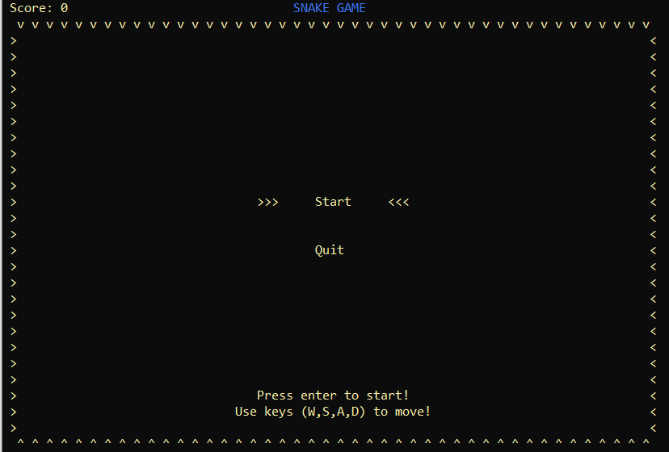
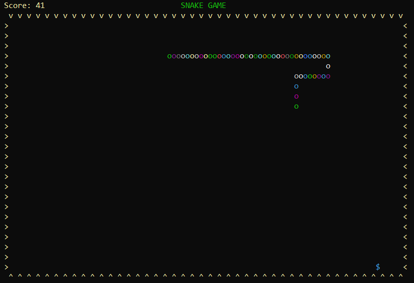

# Snake-Game
------------

## About
------------
This is a final Project - SS004.M13.

Classic snake game on the terminal made with C++

## Contributors
------------
* Nguyen Huu Long - 20521569
* Nguyen Thanh Phat - 20521737
* Van Duc Duy - 20521251
* Vo Nhat Nam - 20520646

## Introduction
------------

From [Wikipedia](http://en.wikipedia.org/wiki/Snake_%28video_game%29):

> Snake is a video game released during the mid 1970s and has maintained
> popularity since then, becoming somewhat of a classic.  The first
> known microcomputer version of Snake, titled 'Worm', was programmed in
> 1978 by P. Trefonas (USA) on the TRS-80 computer, and published by
> CLOAD magazine the same year.  This was followed shortly afterwards
> with versions from the same author for the PET and Apple II computers.
> A microcomputer port of Hustle was first written by P. Trefonas in
> 1979 and published by CLOAD magazine [2].  This was later released by
> Milton Bradley for the TI-99/4A in 1980.

## Playing the game
----------------

The aim of the game is to collect the gold ($), avoid 
borders, including colliding with the tail of the snake itself. As you
collect gold, the snake gets longer, thus increasing the likelihood of
crashing into yourself.  When all gold has been collected you are hauled
to the next level without any warning.

**Note:** There is no concept of lives.  Once you hit an obstacle,
that's it, game over.

## Controls
----------------
To move the Snake:

| Keys            | Actions         |
| --------------- | --------------- |
| a, s, d, w keys | Moves the snake |
| a               | Left            |
| d               | Right           |
| w               | Up              |
